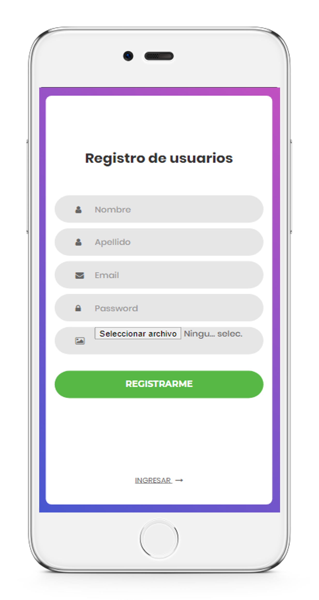
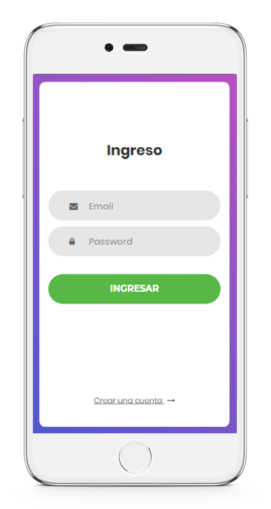
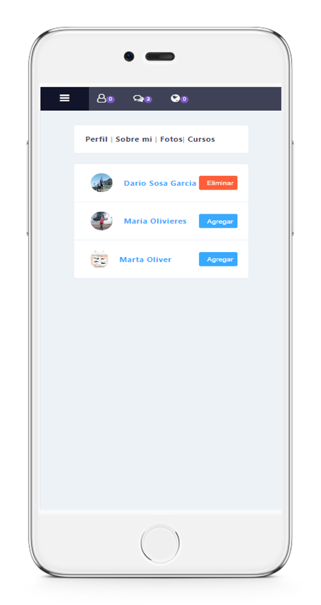
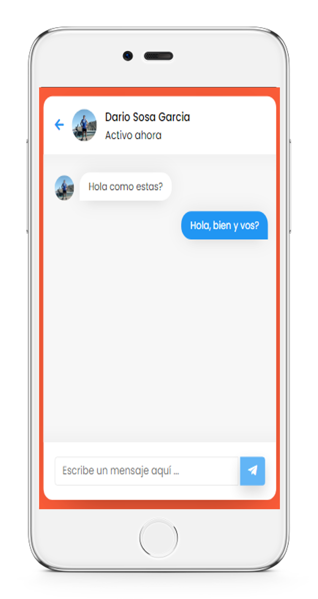
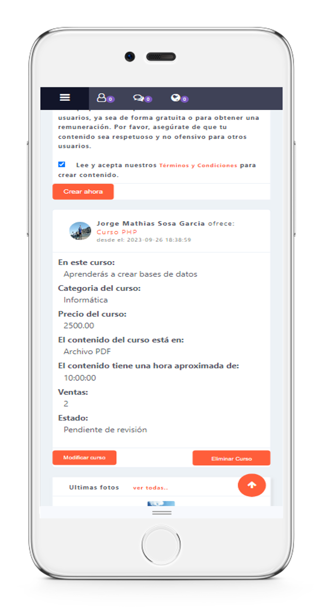
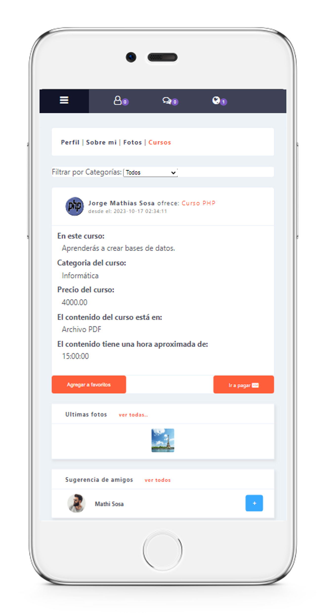
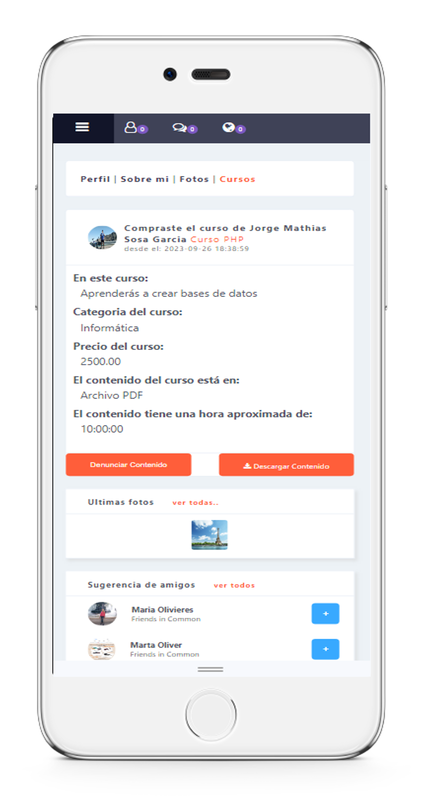
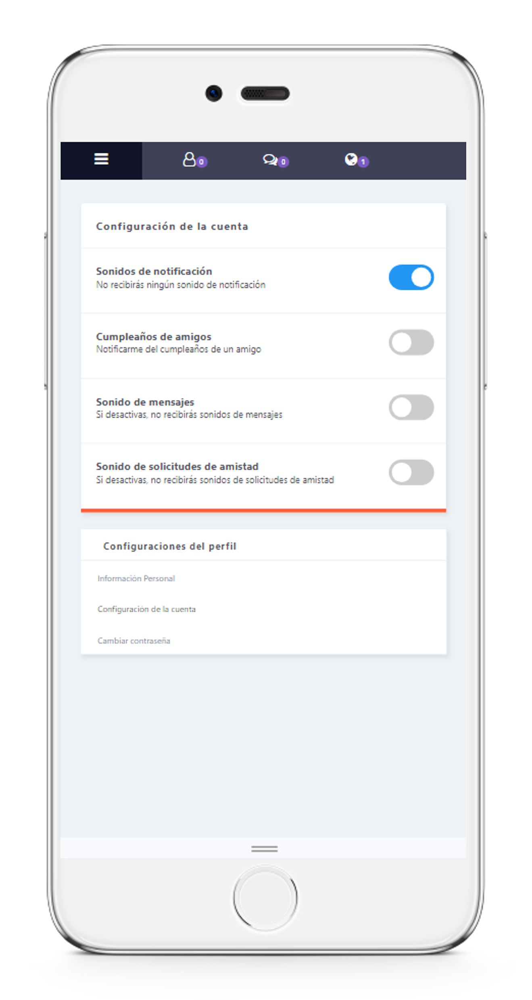

# Red Social similar a facebook, el sistema permite la carga de cursos de pago o gratuitos para su descarga. Posee pasarela de MP, al efectuar el pago, el sistema permite la descarga del curso comprado. 
<table>
  <tr>
    <td> Registro de nuevo usuario</td>
    <td> Ingreso al feed de noticias</td>
    <td> Feed de noticias</td>
  </tr>
  <tr>
    <td> Perfil del usuario</td>
    <td> Solicitudes de amistad</td>
    <td> Chat en tiempo real</td>
  </tr>
  <tr>
    <td> Crear curso para su venta</td>
    <td> Agregar a favoritos o comprar curso</td>
    <td> Curso comprado, listo para su descarga</td>
  </tr>
  <tr>
    <td> Configuración del sistema</td>
  </tr>
</table>
